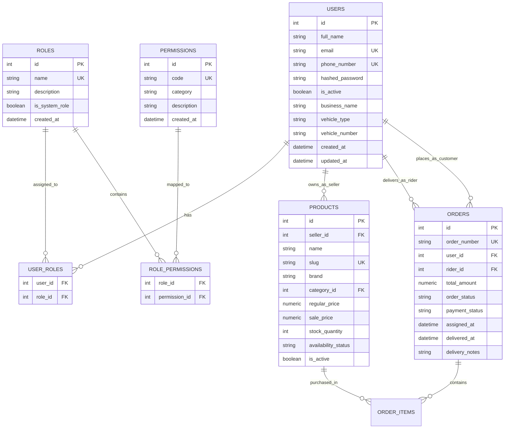

# Specification: Production Grade Supabase Integration with Dynamic RBAC

**Document ID:** `2026-09-02-supabase-rbac-design`  
**Date:** September 2, 2026  
**Status:** Approved by User  
**Target Repository:** `Daraz-alike` (Lyallpur Bazaar)

---

## 1. Overview & Business Objectives

Transform the **Lyallpur Bazaar** marketplace into an enterprise, production-ready e-commerce platform powered by **Supabase PostgreSQL** as the primary relational database, coupled with a dynamic **Role-Based Access Control (RBAC)** architecture.

The platform supports four primary user personas with distinct capabilities and dedicated frontend workflows:
1. **Platform Administrator (`admin`)**: Complete system governance, role & permission management, rider assignment/dispatch, Faisalabad delivery zone pricing, and aggregate sales metrics.
2. **Local Merchant / Seller (`seller`)**: Vendor portal to manage store catalog, update stock and prices, view store-specific order items, and track earnings.
3. **Delivery Rider (`rider`)**: Delivery portal to view assigned Faisalabad orders, access customer drop-off details & Cash-on-Delivery (COD) collection amounts, and update delivery milestones.
4. **Customer (`customer`)**: Local shopping, multi-tier search, Faisalabad zone delivery calculations, address book, COD checkout, and order tracking.

---

## 2. Database & Supabase Architecture

### 2.1 Connection Management & Supabase Pooling
- **Connection Driver**: `psycopg2-binary` with SQLAlchemy 2.0.
- **Connection URL Protocol**: Supports standard Supabase connection strings (`postgresql+psycopg2://[user]:[password]@[host]:[port]/[database]`), automatically normalizing `postgres://` or `postgresql://`.
- **Pool Sizing & Health Checks**:
  - `pool_size = 10`
  - `max_overflow = 20`
  - `pool_recycle = 300` (refreshes connections periodically to avoid stale TCP sockets)
  - `pool_pre_ping = True` (executes a lightweight `SELECT 1` ping before issuing queries, eliminating broken pipe / dropped connection errors with Supavisor)
- **SSL Configuration**: Automatically enforces `sslmode=require` when connecting to Supabase endpoints.
- **Local / Test Fallback**: When `DATABASE_URL` is unset or points to SQLite, the backend continues to support SQLite with WAL mode for isolated, offline unit testing.
- **Supabase Deployment Artifact**: A standalone SQL migration script `supabase/schema.sql` containing:
  - Table creation with foreign key constraints and `ON DELETE CASCADE / SET NULL`.
  - B-tree indexes on foreign keys and search fields.
  - Initial seed data for system roles, standard permissions, default admin, seller, rider, and customer users.

---

## 3. Data Models & Dynamic RBAC Schema



### 3.1 New Entities

1. **`Role` (`roles`)**:
   - `id`: Integer primary key.
   - `name`: Unique string identifier (`customer`, `seller`, `rider`, `admin`, or custom name).
   - `description`: Text explanation of the role.
   - `is_system_role`: Boolean flag (prevents accidental deletion of foundational roles).
   - Relationships: `permissions` (many-to-many via `role_permissions`), `users` (many-to-many via `user_roles`).

2. **`Permission` (`permissions`)**:
   - `id`: Integer primary key.
   - `code`: Unique dotted identifier (e.g., `product:create`, `order:assign_rider`).
   - `category`: Grouping tag (`catalog`, `orders`, `delivery`, `admin`, `system`).
   - `description`: Human-readable label.

3. **`RolePermission` (`role_permissions`)**:
   - Association table linking `role_id` and `permission_id`.

4. **`UserRole` (`user_roles`)**:
   - Association table linking `user_id` and `role_id`.

### 3.2 Modified Entities

1. **`User` (`users`)**:
   - Added `business_name` (Optional string, for sellers).
   - Added `vehicle_type` (Optional string: e.g. "Honda CD 70", "Suzuki Carry", for riders).
   - Added `vehicle_number` (Optional string: e.g. "FDN-2024-8841", for riders).
   - Added relationships: `roles` (many-to-many), `seller_products` (one-to-many), `assigned_deliveries` (one-to-many).

2. **`Product` (`products`)**:
   - Added `seller_id`: Foreign key referencing `users.id` (nullable, `NULL` indicates platform-managed catalog item).
   - Added relationship: `seller` (`User`).

3. **`Order` (`orders`)**:
   - Added `rider_id`: Foreign key referencing `users.id` (nullable, populated on dispatch).
   - Added `assigned_at`: Datetime when assigned to rider.
   - Added `delivered_at`: Datetime when status becomes Delivered.
   - Added `delivery_notes`: Driver/admin drop-off notes.
   - Added relationship: `rider` (`User`).

---

## 4. Default Permission Matrix

| Permission Code | Category | Description | Customer | Seller | Rider | Admin |
|---|---|---|:---:|:---:|:---:|:---:|
| `profile:read_write` | `account` | View & manage personal profile and addresses | ✅ | ✅ | ✅ | ✅ |
| `order:create` | `orders` | Place new customer orders | ✅ | ❌ | ❌ | ✅ |
| `order:view_own` | `orders` | View customer's placed orders | ✅ | ❌ | ❌ | ✅ |
| `product:view_own` | `catalog` | View seller's catalog & stock | ❌ | ✅ | ❌ | ✅ |
| `product:create` | `catalog` | Create new seller products | ❌ | ✅ | ❌ | ✅ |
| `product:update_own` | `catalog` | Update price/stock for seller's own products | ❌ | ✅ | ❌ | ✅ |
| `product:delete_own` | `catalog` | Deactivate seller's own products | ❌ | ✅ | ❌ | ✅ |
| `order:view_seller_items` | `orders` | View order items containing seller's goods | ❌ | ✅ | ❌ | ✅ |
| `delivery:view_assigned` | `delivery` | View assigned delivery runs | ❌ | ❌ | ✅ | ✅ |
| `delivery:update_status` | `delivery` | Update delivery progress (Out for Delivery $\to$ Delivered) | ❌ | ❌ | ✅ | ✅ |
| `order:assign_rider` | `orders` | Dispatch and assign riders to customer orders | ❌ | ❌ | ❌ | ✅ |
| `admin:rbac_manage` | `admin` | Create/edit roles, map permissions, assign user roles | ❌ | ❌ | ❌ | ✅ |
| `admin:catalog_manage_all` | `admin` | Edit or delete any product across all sellers | ❌ | ❌ | ❌ | ✅ |
| `admin:zones_manage` | `admin` | Configure Faisalabad delivery sectors and fees | ❌ | ❌ | ❌ | ✅ |
| `admin:metrics_view` | `admin` | View platform-wide revenue and performance metrics | ❌ | ❌ | ❌ | ✅ |

*Note: The `admin` role has super-access bypass (`*`), automatically satisfying any permission check.*

---

## 5. Security & Authorization Architecture

### 5.1 Token Payloads
JWT access tokens include:
```json
{
  "sub": "42",
  "phone": "03001234567",
  "email": "vendor@store.pk",
  "roles": ["seller"],
  "permissions": ["product:view_own", "product:create", "product:update_own", "order:view_seller_items"],
  "exp": 1741000000
}
```

### 5.2 Dependency Inversion & Verification Helpers
- **`get_current_user`**: Validates JWT signature and loads active user from DB.
- **`require_roles(*roles)`**: Reusable FastAPI dependency ensuring `current_user` has at least one of the specified roles.
- **`require_permissions(*permissions)`**: Reusable dependency ensuring user has all listed permissions (or is `admin`).
- **Product Ownership Verification**: In `app/services/product_service.py`, updating or deleting a product validates that `product.seller_id == current_user.id` unless the user possesses `admin:catalog_manage_all`.

---

## 6. API Route Specification

### 6.1 Authentication (`/api/auth`)
- `POST /register`: Registers customer with default role `customer`.
- `POST /login`: Returns token with aggregated `roles` and `permissions`.
- `GET /me`: Returns full user profile including `roles`, `permissions`, `business_name`, and vehicle info.

### 6.2 Seller Management (`/api/seller`)
*Requires `product:view_own` or role `seller`*
- `GET /dashboard`: Summary metrics: total seller products, low-stock count, seller sales volume (PKR), active orders.
- `GET /products`: List products where `seller_id == current_user.id`.
- `POST /products`: Create product with `seller_id` automatically bound to `current_user.id`.
- `PUT /products/{product_id}`: Update stock, regular/sale price, description (ownership enforced).
- `DELETE /products/{product_id}`: Soft delete product (set `is_active = False`).
- `GET /orders`: View orders that contain one or more products belonging to this seller.

### 6.3 Rider Deliveries (`/api/rider`)
*Requires `delivery:view_assigned` or role `rider`*
- `GET /dashboard`: Metrics: pending deliveries, delivered today, COD cash to remit.
- `GET /deliveries`: List active assigned orders (`rider_id == current_user.id` and status not Delivered/Cancelled).
- `PUT /deliveries/{order_id}/status`: Milestone transition (`Out for Delivery` $\to$ `Delivered`) and add delivery notes.
- `GET /history`: Completed deliveries with date, customer locality, and collected amount.

### 6.4 Admin RBAC & Dispatch (`/api/admin`)
*Requires `admin:rbac_manage` or role `admin`*
- `GET /admin/rbac/roles`: List all system and custom roles with permissions.
- `POST /admin/rbac/roles`: Create new custom role.
- `PUT /admin/rbac/roles/{role_id}/permissions`: Update list of permissions mapped to role.
- `GET /admin/rbac/permissions`: List all available system permissions grouped by category.
- `GET /admin/rbac/users`: Search and list users with assigned roles.
- `PUT /admin/rbac/users/{user_id}/roles`: Assign or remove roles for a user.
- `GET /admin/riders`: List available delivery riders for dispatch selection.
- `PUT /admin/orders/{order_id}/assign-rider`: Assign a rider (`rider_id`) to an order and advance status to `Packed` / `Out for Delivery`.

---

## 7. Frontend User Experience & Portals

### 7.1 Navigation & Role Adaptability
- Global header displays contextual links:
  - `Customer`: "My Account" (`/account`), "Cart"
  - `Seller`: "🏪 Seller Hub" (`/seller`)
  - `Rider`: "🛵 Rider Portal" (`/rider`)
  - `Admin`: "🛡️ Admin Portal" (`/admin`)

### 7.2 Protected Route Guard
- Component: `<ProtectedRoute allowedRoles={['seller', 'admin']} requiredPermissions={['...']} />`
- Intercepts unauthorized navigation, displays notification, and redirects to `/login`.

### 7.3 Portals Implementation
- **Seller Hub (`/seller`)**:
  - Tab 1: Catalog & Stock Management (inline quick-edit for stock and price, add new product modal).
  - Tab 2: Store Orders (order numbers, purchased items, buyer locality, status).
  - Tab 3: Store Profile (business name, registered phone).
- **Rider Portal (`/rider`)**:
  - Tab 1: Active Run List (interactive cards with customer name, phone call link, delivery locality, landmark, COD PKR amount, and single-click "Mark Delivered" action).
  - Tab 2: Delivery History & Cash Summary (total COD cash collected during current shift).
- **Admin Portal Extensions (`/admin`)**:
  - Tab: **RBAC Matrix** (interactive checkboxes to view and configure permissions per role; user search and role assignment).
  - Order Management: Rider dispatch modal to assign orders to riders.

### 7.4 One-Click Demo Personas
The `/login` page offers quick login buttons for immediate testing:
- **Admin**: `admin@lyallpurbazaar.pk` / `Admin@123`
- **Seller**: `seller@lyallpurbazaar.pk` / `Seller@123`
- **Rider**: `rider@lyallpurbazaar.pk` / `Rider@123`
- **Customer**: `customer@lyallpurbazaar.pk` / `Customer@123`

---

## 8. Verification & Testing Strategy

### 8.1 Automated Backend Pytest Suite
1. **RBAC Unit & Integration Tests (`backend/tests/test_rbac.py`)**:
   - Verifies password hashing and JWT token claims containing roles and permissions.
   - Tests permission checks: unauthorized access returns HTTP 403 Forbidden.
   - Tests role creation, permission mapping, and user role updates via `/api/admin/rbac`.
   - Tests seller catalog isolation: Seller A cannot edit Seller B's products.
   - Tests rider order isolation: Rider A cannot update Rider B's delivery runs.
   - Tests rider dispatch and order status progression.
2. **Regression Verification**:
   - Existing 11 test suites in `backend/tests/test_api.py` remain passing without breakage.

### 8.2 Frontend Build & Integration
- Verification command: `npm run build --prefix frontend`.
- Zero TypeScript/JSX compilation errors.
