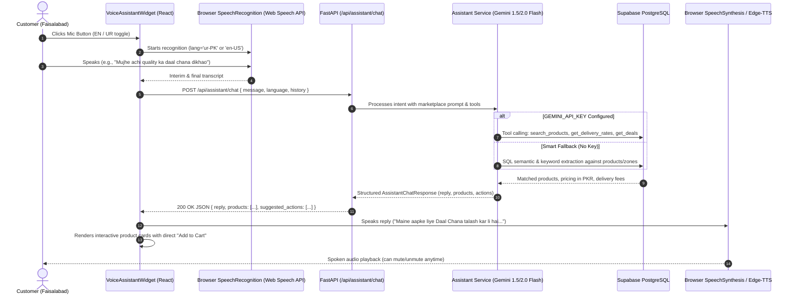

# Design Spec: Embedded AI Voice Shopping Assistant

- **Date**: 2026-09-04
- **Status**: Validated & Approved
- **Author**: Antigravity & User
- **Target System**: Lyallpur Bazaar (React/Vite Frontend + FastAPI/Supabase PostgreSQL Backend)

---

## 1. Overview & Business Goal

Lyallpur Bazaar is a local multi-vendor e-commerce marketplace focused on Faisalabad, Pakistan. To make local commerce effortless for shoppers across diverse literacy levels and regional languages, we are adding an **Embedded Two-Way Interactive AI Voice Shopping Assistant**.

Shoppers can tap a floating microphone button anywhere on the storefront to speak in **Urdu, Roman Urdu, or English**. The assistant processes the query, searches live products in the Supabase catalog, provides accurate delivery fees and timelines across Faisalabad localities, replies with natural conversational text, speaks the answer back via Text-to-Speech (TTS), and renders interactive product cards with direct "+ Add to Cart" capabilities.

---

## 2. Architecture & Data Flow



---

## 3. Frontend Architecture

### 3.1 Component Breakdown (`frontend/src/components/assistant/`)

1. **`VoiceAssistantWidget.jsx`**:
   - Primary floating container placed persistently in `App.jsx`.
   - **Collapsed State**: Sleek brand-green floating circular button (`bottom-6 right-6 z-50`) with an animated microphone icon and helpful tooltip (*"Ask Lyallpur AI"*).
   - **Expanded State**: Sleek conversational drawer (`w-96 max-h-[550px] shadow-2xl rounded-2xl border border-gray-100 bg-white flex flex-col`).
   - **Header**:
     - Assistant avatar with online pulsing indicator.
     - Live state badge (*"Listening..."*, *"Thinking..."*, *"Speaking..."*, *"Ready"*).
     - Language toggle button (`🌐 UR / EN`).
     - Audio mute/unmute toggle (`🔊 / 🔇`).
     - Minimize drawer button.
   - **Body**:
     - Scrollable message stream with markdown formatting.
     - Embedded `VoiceVisualizer` audio waveform active during listening and speaking.
     - Interactive product card carousel for search results.
     - Suggested action pills (e.g., *"D Ground delivery fee"*, *"Show Deals"*, *"View Cart"*).
   - **Footer**:
     - Central push-to-talk mic button with glowing ring.
     - Clean text input field with send button for text fallback.

2. **`VoiceVisualizer.jsx`**:
   - Real-time animated CSS soundbars that oscillate when recording user input or when the assistant is speaking audio.

3. **`AssistantProductCard.jsx`**:
   - Compact product card tailored for the assistant drawer:
     - Product thumbnail image.
     - Product title and pack size/unit (e.g. `1 kg`, `Unstitched 3pc`).
     - Price formatted in PKR (`Rs. 450`).
     - Availability badge.
     - Direct **"+ Add"** button connected to `CartContext.addToCart`.

4. **`LanguageToggle.jsx`**:
   - Allows users to switch speech recognition between Urdu (`ur-PK`) and English (`en-US` / `en-PK`).

### 3.2 Custom Hooks (`frontend/src/hooks/`)

1. **`useSpeechRecognition.js`**:
   - Wraps browser `window.webkitSpeechRecognition` / `window.SpeechRecognition`.
   - Exposes: `{ isListening, transcript, interimTranscript, startListening, stopListening, isSupported, error }`.
   - Automatically handles permission denial, audio timeout (6-second silence cutoff), and language switching (`ur-PK` vs `en-US`).

2. **`useSpeechSynthesis.js`**:
   - Wraps browser `window.speechSynthesis`.
   - Exposes: `{ isSpeaking, isMuted, toggleMute, speak, stopSpeaking }`.
   - Picks natural regional voices (`ur-PK` or `en-PK`/`en-US`), handles clean cancellation when the user begins speaking, and allows mute control.

---

## 4. Backend Architecture

### 4.1 API Endpoints (`backend/app/routers/assistant.py`)

#### 1. `POST /api/assistant/chat`
- **Request Schema (`AssistantChatRequest`)**:
  ```python
  class ChatMessage(BaseModel):
      role: str  # "user" or "assistant"
      content: str

  class AssistantChatRequest(BaseModel):
      message: str
      language: Optional[str] = "en"  # "en" or "ur"
      history: Optional[List[ChatMessage]] = []
  ```
- **Response Schema (`AssistantChatResponse`)**:
  ```python
  class AssistantChatResponse(BaseModel):
      reply: str
      products: List[ProductOut] = []
      suggested_actions: List[str] = []
      action: Optional[str] = None  # e.g., "open_cart", "navigate_category"
  ```

#### 2. `POST /api/assistant/speak`
- **Request Schema (`AssistantSpeakRequest`)**:
  ```python
  class AssistantSpeakRequest(BaseModel):
      text: str
      language: Optional[str] = "ur"  # "ur" or "en"
  ```
- **Response**:
  - Direct audio/mpeg stream using `edge-tts` with Pakistani neural voices:
    - Urdu: `ur-PK-UzmaNeural` (female) or `ur-PK-AsadNeural` (male).
    - English: `en-PK-UzmaNeural` or `en-US-JennyNeural`.

### 4.2 Assistant Service (`backend/app/services/assistant_service.py`)

1. **System Persona & Knowledge Grounding**:
   - Dedicated persona: *"Lyallpur Assistant"* — warm, trustworthy, and expert on Faisalabad's trade, textiles (Khadim, Gul Ahmed, Sitara, local Khaddi), fresh grocery staples, and delivery sectors (Peoples Colony, D Ground, Batala Colony, Madina Town, Susan Road, Ghulam Muhammad Abad, Eden Garden, etc.).
   - Bilingual mastery: Fluent in Urdu (اردو), Roman Urdu, and English.

2. **Tool / Function Calling (Gemini Flash)**:
   - When `GEMINI_API_KEY` is present, prompts `gemini-1.5-flash` with structured function tools:
     - `search_catalog(query, category_slug, max_price)`
     - `get_delivery_rates(locality)`
     - `get_deals()`

3. **Smart Local Fallback (Zero-API-Key Resilience)**:
   - If `GEMINI_API_KEY` is not configured or in case of external network timeouts, the service uses semantic pattern matching:
     - Regex-based intent detection (product query, delivery query, deal query, cart query).
     - Direct SQLAlchemy queries against PostgreSQL `products`, `categories`, and `delivery_zones`.
     - Generates fluent bilingual replies and returns relevant product items so the platform works 100% out of the box without mandatory third-party credentials.

---

## 5. Error Handling & Resilience

1. **Microphone Denied / Browser Unsupported**:
   - Detection in `useSpeechRecognition`: sets `isSupported=false` or `permissionDenied=true`.
   - UI gracefully collapses the microphone animation and focuses the text input field with clear guidance: *"Microphone unavailable. You can type your request here."*
2. **Speech Silence Timeout**:
   - 6-second silence timer automatically closes the microphone state without errors.
3. **Instant Audio Cancellation**:
   - Tapping the mic button immediately interrupts and halts any active audio speech playback.
4. **Vercel Serverless Ready**:
   - Router exported in `backend/app/main.py` and referenced in root `api/index.py` for full Vercel compatibility.

---

## 6. Testing & Quality Verification

1. **Backend Integration Tests (`backend/tests/test_assistant_api.py`)**:
   - `test_assistant_chat_product_search`: Query for staple items returns status 200 with structured product list.
   - `test_assistant_chat_delivery_inquiry`: Query for Faisalabad sectors (e.g. "D Ground", "Peoples Colony") returns correct delivery fees and timing.
   - `test_assistant_chat_multilingual`: Validates English, Urdu script, and Roman Urdu.
   - `test_assistant_smart_fallback`: Validates fallback operates cleanly with zero API keys configured.
   - `test_assistant_speak_audio`: Validates `/api/assistant/speak` returns valid audio bytes.
2. **Frontend Build Verification**:
   - Production Vite build (`npm run build`) runs cleanly with 0 errors.
   - End-to-end verification of widget rendering, audio visualizer, language toggle, and cart additions.
